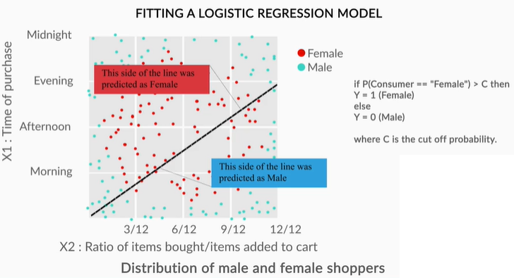

# Model Selection - Best Practices

## Introduction
Welcome to the session on **'Model Selection'**. Till now, you have learnt various machine learning models such as **logistic regression, support vector machines, decision trees, and random forests**. The question is, **how do you choose** which **model(s)** to apply to a given business problem?

One option is to apply all the models and compare their results; but is it always feasible to apply all the models? Sometimes, you won’t have enough time to try all the available options. More importantly, it is helpful to be able to identify some guiding principles behind the choice of models, rather than using a hit-and-trial approach. We will address this problem in this module.

### Understanding the Business Problem
In this segment, we will understand the business problem that you are going to solve.

Let's look at the **business problem** that you are going to solve by applying different machine learning models that you've learnt.

In the next segment, you will see the **decision boundary** of a logistic regression model before predicting the gender of consumers using logistic regression and other machine learning models.

### Comprehension - Logistic Regression

### Comparing Different Machine Learning Models - I
You understood the business problem. Now, let’s see how different machine learning models classify the gender of the consumers of an e-commerce website.

The models that you will use are
1. Logistic Regression
2. Decision Trees
3. Support Vector Machine

First, let’s see how **logistic regression** tackles the problem.

The linear decision boundary of logistic regression is clearly not able to separate out the two classes in this case. Thus, we need to try other models. 
1. A logistic regression model calculates the class probabilities of all the classes of the outcome variable, while predicting a test case.
2. The decision boundary of an LR model is a straight line. The logistic regression model separates two different classes using a line linearly. The sigmoid curve is only used to calculate class probabilities. The final classes are predicted based on the cutoff chosen after building the model.

Let’s see how a decision tree classifies gender.

Decision trees certainly did a better job of differentiating between the two classes. You saw two decision tree models. The first one, with only three decision rules, was a relatively simple tree, while the second one, with 12 decision rules, was a more complex tree. In comparison to the first tree, the second one could potentially **overfit** the training set.

In the next segment, you'll see how **SVM** divides the two classes.

### Comparing Different Machine Learning Models - II
Now, let’s see how **SVM** classifies gender and compare it with the logistic regression and decision tree models.

SVM differentiates the two classes almost perfectly, using a hyperplane that looks like a circle when picturing it in a two-dimensional space. In this business problem, SVM does a much better job than a decision tree or logistic regression.

You saw how logistic regression, decision trees and support vector machines classified the gender of the shoppers by creating different decision boundaries. It's time for you to do some modelling in Python. Download the following dataset which contains the ecommerce consumers' information.

[Ecommerce Consumers Data](dataset/ecommerce_consumers.csv)

### Pros and Cons of Different Machine Learning Models
In the last segment, you saw how each model fits and separates the two gender classes. You observed that logistic regression was outperformed by the decision tree model, which in turn was outperformed by the SVM model. Does this mean SVM is the better choice than decision trees and logistic regression?

In this section, you will learn about the advantages and disadvantages of each of these models. This will make it easier for you to shortlist the models depending on the situation.

Let’s first look at the **advantages** of each model.

#### Pros
1. **Logistic regression**
    1. It is convenient for generating probability scores.
    2. Efficient implementation is available across different tools.
    3. The issue of multicollinearity can be countered with regularisation.
    4. It has widespread industry use.

2. **Decision trees**
    1. Intuitive decision rules make it easy to interpret.
    2. Trees handle nonlinear features well.
    3. The variable interaction is taken into account.

3. **Support vector machines**
    1. SVMs can handle large feature space.
    2. These can handle nonlinear feature interaction.
    3. They do not rely on the entire dimensionality of the data for the transformation.

#### Cons
1. **Logistic regression**
    1. It does not perform well when the features space is too large.
    2. It does not perform well when there are a lot of categorical variables in the data.
    3. The nonlinear features have to be transformed to linear features in order to efficiently use them for a logistic model.
    4. It relies on entire data i.e. if there is even a small change in the data, the logistic model can change significantly.

2. **Decision trees**
    1. Trees are highly biased towards the training set and overfit it more often than not.
    2. There is no meaningful probability score as the output.

3. **Support vector machines**
    1. SVMs are not efficient in terms of computational cost when the number of observations is large.
    2. It is tricky and time-consuming to find the appropriate kernel for a given data.

### End-to-End Modelling - I
You saw how logistic regression, decision trees, and support vector machines perform on different business problems. You also learnt the advantages and disadvantages of all these models. Let’s now look at **how you should go about modelling**, given a particular problem.

You could get overwhelmed by the choice of algorithms available for classification. To summarise—
1. **Start with logistic regression**. Using a logistic regression model serves two purposes: 1) It acts as a baseline (benchmark) model. 2) It gives you an idea about the important variables.
2. Then, go for **decision trees** and compare their performance with the logistic regression model. If there is no significant improvement in their performance, then just use the important variables drawn from the logistic regression model.

Finally, if you still do not meet the performance requirements, use **support vector machines**. But, keep in mind the **time and resource constraints**, because it takes time to find an appropriate kernel for SVM. Also, they are computationally expensive.

### CART and CHAID Trees
So far, you studied a specific type of tree: **CART (Classification and Regression Trees)**. There is one more tree that is used widely. It is called **CHAID (Chi-square Automatic Interaction Detection)**. Both of these trees have different applications. A **chi-square test** is a statistical hypothesis test where the test statistic is chi-squared distribution. This test is used to compare the interaction of independent variables with the dependent variable.

You are already familiar with **CART**, which creates a **binary tree**-a tree with a maximum of two child nodes for any node in the tree. Sometimes CART is not appropriate to visualise the important features in a dataset because binary trees tend to be much **deeper** and more **complex** than a **non-binary tree**- a tree which can have more than two child nodes for any node in the tree. This is where CHAID comes in. CHAID can create non-binary trees which tend to be shallower than the binary trees. This makes CHAID trees easier to look at and understand the important drivers (features) in a business problem. The process of finding out important features is also referred to as **driver analysis**.

Let’s study the differences between the two, in detail.

1. CART is preferred for prediction.
2. CHAID is better suited for driver analysis.

You looked at the different applications of CART and CHAID trees. To put them in the form of an analogy, suppose you are working with the Indian cricket team, and you want to **predict** whether the team will win a particular tournament or not. In this case, **CART** would be more preferable because it is more suitable for prediction tasks. Whereas, if you want to look at the **factors** that are going to influence the win/loss of the team, then a **CHAID** tree would be more preferable.

**Additional Resources**
CHAID-Analysis (https://www.analyticsvidhya.com/blog/2016/04/tree-based-algorithms-complete-tutorial-scratch-in-python/)

### Choosing between Trees and Random Forests - I
In the last session, you learnt about random forests. But when do you use a decision tree, and when do you use a random forest? Which one is the better choice for a given problem? We will answer these questions in this segment.

**Note:** The equivalent of the 'mtry' parameter that's used in R is the 'max_features' parameter the scikit-learn package of Python. It is used to pass the number of features that a decision tree considers while splitting each node.

You learnt about decision trees and random forests. Now, let’s understand **how to choose between the two**.

**Disadvantages of decision trees:**

1. Trees have a tendency to **overfit** the training data.
2. Splitting with **multiple linear decision boundaries that are perpendicular to the feature space** is not always efficient.
3. It is not possible to **predict beyond the range** of the response variable in the training data in a regression problem. Suppose you want to predict house prices using a decision tree and the range of the the house price (response variable) is $5000 to $35000. While predicting, the output of the decision tree will always be within that range.

**Advantages of random forests:**
1. No need to **prune** the trees of a forest.
2. The **OOB error** can be calculated from the training data itself which gives a good estimate of the model performance on unseen data.
3. It is hard for a random forest to **overfit** the training data.
4. A random forest is not affected by **outliers** as much because of the aggregation strategy.

### Choosing between Trees and Random Forests - II
Despite having many advantages, random forests also have certain **limitations**. Let’s look at these in detail.

The limitations of a random forest are:
1. Owing to their origin to decision trees, random forests have the same problem of **not predicting beyond the range of the response variable** in the training set.
2. The **extreme values are often not predicted** because of the aggregation strategy. To illustrate this, let’s take the house prices example, where the response variable is the price of a house. Suppose the range of the price variable is between $5000 and $35000. You train the random forest and then make predictions. While making predictions for an expensive house, there will be some trees in the forest which predict the price of the house as $35000, but there will be other trees in the same forest with values close to $35000 but not exactly $35000. In the end, when the final price is decided by aggregating using the mean of all the predictions of the trees of the forest, the predicted value will be close to the extreme value of $35000 but not exactly $35000. Unless all the trees of the forest predict the house price to be $35000, this extreme value will not be predicted.

In the next segment, you'll see how to go about **modelling different machine learning algorithms** and choose the appropriate one, under the given time and resource constraints of a business problem.

### End-to-End Modelling - II
So far, you learnt multiple machine learning models. They include
1. Logistic regression
2. Decision trees
3. Support vector machines
4. Types of decision trees
5. Random forests

Sometimes, you may get overwhelmed and confused by the choice of models. Let’s understand **how you should go about modelling**, and which model you should choose in a given problem.

To summarise, you should start with a **logistic regression model**. Then, build a **decision tree** model. While building a decision tree, you should choose the appropriate method: **CART** for predicting and **CHAID** for driver analysis. If you are not satisfied with the model performance mentioned so far, and you have sufficient time and resources in hand, then go ahead and build more complex models like **random forests** and **support vector machines**.

 